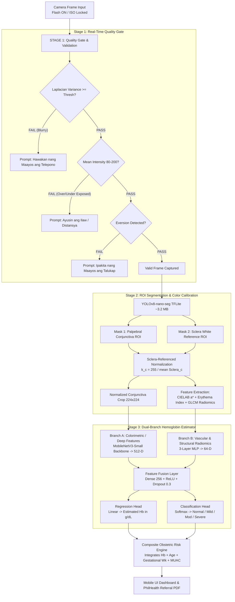

<div align="center">

# 👁️ TingínHB

### *Non-Invasive, Zero-Consumable Smartphone Hemoglobin Screening for Maternal Health*

[](https://opensource.org/licenses/MIT)
[](https://www.python.org/)
[](https://pytorch.org/)
[](https://flutter.dev/)
[-3DDC84.svg?logo=android&logoColor=white)](https://developer.android.com/)
[](https://dict.gov.ph/)
[]()

<br/>

> **"Tingin"** *(Tagalog: Look / See)* + **"HB"** *(Hemoglobin)*  
> **"See Anemia Before It Kills."**

*A smartphone-based, non-invasive hemoglobin screening tool that turns every Barangay Health Worker’s phone camera into a zero-consumable anemia detector — directly preventing maternal death from postpartum hemorrhage.*

---

**Developed for the Philippine Startup Challenge XI (PSC XI) — Prototype-Ready Solution Track**  
*Authored by 3rd-Year Data Science Students*

</div>

<br/>

---

## 📌 Table of Contents

- [Executive Summary](#-executive-summary)
- [The Problem: Maternal Anemia \& Postpartum Hemorrhage in the Philippines](#-the-problem-maternal-anemia--postpartum-hemorrhage-in-the-philippines)
  - [The Crisis in Numbers](#the-crisis-in-numbers)
  - [The Diagnostic Gap in Rural Healthcare](#the-diagnostic-gap-in-rural-healthcare)
  - [Why Palpebral Conjunctiva?](#why-palpebral-conjunctiva)
- [The TingínHB Solution](#-the-tingínhb-solution)
- [For Barangay Health Workers (BHWs) — Gabay sa Paggamit](#-for-barangay-health-workers-bhws--gabay-sa-paggamit)
- [System \& Pipeline Architecture](#-system--pipeline-architecture)
  - [Stage 1: Image Acquisition \& Quality Gate](#stage-1-image-acquisition--quality-gate)
  - [Stage 2: ROI Segmentation \& Color Normalization](#stage-2-roi-segmentation--color-normalization)
  - [Stage 3: Hemoglobin Estimation \& Clinical Classification](#stage-3-hemoglobin-estimation--clinical-classification)
- [Model Performance Targets \& Evaluation Metrics](#-model-performance-targets--evaluation-metrics)
- [Datasets \& Data Augmentation Strategy](#-datasets--data-augmentation-strategy)
- [Philippine Health Policy Alignment \& Regulatory Pathway](#-philippine-health-policy-alignment--regulatory-pathway)
- [Competitive Landscape \& Prior Art](#-competitive-landscape--prior-art)
- [Project Directory Structure](#-project-directory-structure)
- [Tech Stack](#-tech-stack)
- [Quick Start: Developer Guide](#-quick-start-developer-guide)
  - [Prerequisites](#prerequisites)
  - [Installation \& Running in 5 Commands](#installation--running-in-5-commands)
- [Mobile Application Walkthrough](#-mobile-application-walkthrough)
- [Explainability \& Interpretability](#-explainability--interpretability)
- [Contributing \& Code of Conduct](#-contributing--code-of-conduct)
- [Seminal References \& Citations](#-seminal-references--citations)
- [License \& Acknowledgements](#-license--acknowledgements)

---

## 🚀 Executive Summary

In rural and geographically isolated and disadvantaged areas (GIDAs) across the Philippines, maternal mortality remains an urgent public health crisis. **Postpartum Hemorrhage (PPH)** accounts for nearly one in three maternal deaths in the country, and maternal anemia drastically exacerbates this risk by impairing uterine contraction and depleting physiological blood reserve. 

While clinical hemoglobin tests exist, rural **Barangay Health Stations (BHS)** and **Rural Health Units (RHUs)** cannot afford standard point-of-care analyzers (such as HemoCue, costing ₱70,000+ per unit with ₱105–₱150 per disposable microcuvette). Consequently, frontline **Barangay Health Workers (BHWs)** are forced to rely on subjective visual inspections of the lower eyelid, missing more than 50% of mild-to-moderate anemia cases.

**TingínHB** bridges this diagnostic divide by leveraging a multi-stage, edge-optimized Computer Vision and Deep Learning pipeline:
1. **Zero Consumables:** ₱0 recurring cost per test.
2. **100% Offline Inference:** Runs entirely on entry-level Android smartphones (~₱5,000 devices) in under 60 milliseconds with a total model footprint of ~7.7 MB.
3. **Melanin-Invariant Optical Site:** Operates on the palpebral conjunctiva (a non-pigmented vascular bed) and utilizes the adjacent sclera as an internal, in-frame white reference for real-time illumination compensation.
4. **Point-of-Care Triage:** Delivers immediate Hb estimates, clinical severity stratification, composite obstetric risk scoring, and automatic referral documentation compliant with the PhilHealth Konsulta Package.

```
+----------------------------------------------------------------------------------------------------+
|                                      THE TINGÍNHB PIPELINE                                         |
|                                                                                                    |
|  [ Everted Eyelid Photo ] ---> [ Quality Gate ] ---> [ YOLOv8-nano-seg ] ---> [ Sclera-Ref Norm ]  |
|                                (Blur/Lighting)         (Conjunctiva & Sclera)   (White Calibration)|
|                                                                |                                   |
|                                                                v                                   |
|  [ PhilHealth Konsulta PDF ] <-- [ Risk Stratification ] <-- [ Dual-Branch MobileNetV3-Small ]     |
|      (Referral System)             (Normal/Mild/Mod/Sev)       (Colorimetric + Vascular Radiomics) |
+----------------------------------------------------------------------------------------------------+
```

---

## 🩸 The Problem: Maternal Anemia & Postpartum Hemorrhage in the Philippines

### The Crisis in Numbers

```
  Maternal Mortality Ratio (MMR)       Maternal Deaths from PPH           Pregnant Filipino Women Anemic
      119 - 144 per 100k                      25% - 30%                              21.8%
   (SDG 2030 Target: <70/100k)           (#1 Killer of Mothers)               (DOST-FNRI 2023-2024)
```

- **Maternal Mortality Crisis:** The Philippines records a Maternal Mortality Ratio (MMR) of **119 to 144 deaths per 100,000 live births**, significantly lagging behind the UN Sustainable Development Goal (SDG 3.1) target of less than 70 per 100,000 live births by 2030.
- **PPH as the Leading Direct Cause:** Postpartum Hemorrhage accounts for **25% to 30%** of all maternal deaths in the country. Approximately **2,000+ mothers die annually**, the majority of which are preventable with timely identification and treatment of predisposing risk factors.
- **The Pathophysiological Link:** According to DOST-FNRI national survey data, **21.8% of pregnant Filipino women are anemic**. An anemic mother ($\text{Hb} < 9.0 \text{ g/dL}$) has a **2.5$\times$ to 4.0$\times$ higher risk of fatal postpartum hemorrhage**. Anemia induces severe uterine atony (inability of the myometrium to contract and compress spiral arterioles post-delivery), reduces cellular oxygen delivery, and leaves zero physiological reserve during routine delivery-associated blood loss.

```
                    +-------------------------------------------------------+
                    |           Undetected Maternal Anemia (Hb < 9 g/dL)    |
                    +-------------------------------------------------------+
                                                |
                        +-----------------------+-----------------------+
                        |                                               |
                        v                                               v
        +-------------------------------+               +-------------------------------+
        |    Myometrial Hypoxia &       |               | Depleted Physiological Reserve|
        |       Uterine Atony           |               |   & Impaired Hemostasis       |
        +-------------------------------+               +-------------------------------+
                        |                                               |
                        +-----------------------+-----------------------+
                                                |
                                                v
                    +-------------------------------------------------------+
                    |             Severe Postpartum Hemorrhage              |
                    |           Rapid Hypovolemic Shock & Death             |
                    +-------------------------------------------------------+
```

---

### The Diagnostic Gap in Rural Healthcare

Frontline primary care facilities in the Philippines face severe structural and economic constraints:

| Diagnostic Modality | Capital Equipment Cost | Recurring Consumable Cost | Sensitivity (Hb 9–11 g/dL) | Operational Feasibility in GIDAs / BHS |
| :--- | :--- | :--- | :--- | :--- |
| **Laboratory CBC (Venipuncture)** | ₱350,000 – ₱1,200,000 | ₱200 – ₱450 / test | 99% (Gold Standard) | ❌ Inaccessible; requires cold chain, centrifuge, phlebotomist |
| **Point-of-Care (HemoCue 301)** | ₱70,000 – ₱125,000 | ₱105 – ₱150 / cuvette | 92% – 96% | ❌ Unbudgeted; microcuvettes expire, high ongoing cost |
| **BHW Visual Pallor Inspection** | ₱0 | ₱0 | **10% – 60% (Subjective)** | ⚠️ Standard practice; misses >50% of anemic cases ($\kappa = 0.20-0.45$) |
| **TingínHB (Our Solution)** | **₱0 (uses existing phone)**| **₱0 (zero consumables)** | **$\ge$ 85% (Objective AI)** | ✅ **100% Offline, runs on entry-level Android** |

#### Limitations of Current BHW Visual Inspection:
1. **Low Sensitivity:** BHWs looking for conjunctival/palmar pallor routinely fail to identify mild-to-moderate anemia ($\text{Hb } 9.0 - 10.9 \text{ g/dL}$), which is precisely the stage where oral Iron-Folic Acid (IFA) supplementation can reverse anemia before delivery.
2. **Inter-Observer Discrepancy:** Cohen's kappa coefficient ($\kappa$) for visual conjunctival inspection ranges between **0.20 and 0.45** (indicating poor-to-fair agreement).
3. **Lighting Dependency:** Ambient illumination in rural consultations (ranging from open-air bamboo barangay halls to incandescent clinics) drastically skews naked-eye human perception.

---

### Why Palpebral Conjunctiva?

The palpebral conjunctiva (the inner mucosal lining exposed by gently pulling down the lower eyelid) represents the gold-standard optical window for non-invasive optical estimation:

1. **Absence of Epidermal Melanin:** Unlike fingertips, palms, or facial skin, the palpebral conjunctiva contains **zero melanocytes**. Consequently, optical hemoglobin readings are **completely unaffected by skin pigmentation** (Fitzpatrick Skin Phototypes III through VI common across the Philippine population).
2. **High Capillary Density:** The microvasculature of the conjunctiva sits immediately beneath a transparent, thin epithelial layer (2–3 cells thick), exposing blood chromophore absorption ($HbO_2$ and $Hb$) directly to the camera sensor.
3. **Built-in Sclera White Reference:** The white sclera sits directly adjacent to the palpebral conjunctiva in the exact same image frame, providing a natural calibration standard to eliminate color casting and varying ambient light.

```
       [ CROSS-SECTION: OPTICAL ADVANTAGE OF PALPEBRAL CONJUNCTIVA ]

          SKIN / FINGERNAIL                      PALPEBRAL CONJUNCTIVA
     +--------------------------+             +--------------------------+
     |   Stratum Corneum        |             |   Thin Mucosa (Non-ker)  |
     +--------------------------+             +--------------------------+
     |   Melanin Layer (VARIES) |  <-- BIAS   |   ZERO MELANIN           |  <-- 100% INVARIANT
     +--------------------------+             +--------------------------+
     |   Dermal Capillaries     |             |   Dense Capillary Bed    |
     +--------------------------+             +--------------------------+
     (Varies with Fitzpatrick Scale)           (Direct Optical Access to Hb)
```

---

## 💡 The TingínHB Solution

**TingínHB** transforms an ordinary ₱5,000 Android smartphone into a regulated, edge-based point-of-care hemoglobin screening workstation:

- 📸 **Non-Invasive Image Capture:** The BHW snaps a single macro photo of the patient's everted lower eyelid with the camera flash enabled.
- ⚡ **Instant Multi-Head Prediction:** In $<60\text{ ms}$, the on-device AI segments the tissue, normalizes the color spectrum against the sclera, and estimates hemoglobin concentration ($\text{g/dL}$) along with clinical severity categories.
- 📉 **Composite Obstetric Risk Scoring:** Combines estimated Hb with maternal age, gestational week, and Mid-Upper Arm Circumference (MUAC in cm) to compute an immediate PPH Risk Index.
- 📋 **Automated Referral Letter Generation:** Generates a standardized, printable/shareable PDF referral letter compliant with the **PhilHealth Konsulta** format for immediate escalation to the nearest Municipal Health Office (MHO) or District Hospital.

---

## 👩‍⚕️ For Barangay Health Workers (BHWs) — Gabay sa Paggamit

<div align="center">
  <h3>❤️ <i>Dinisenyo para sa Bawat Barangay Health Worker sa Pilipinas</i></h3>
</div>

Ang **TingínHB** ay ginawa upang maging katuwang ng bawat BHW sa komunidad. Hindi na kailangan ng mamahaling gamit o tusok sa daliri upang malaman kung anemic ang isang buntis o bata.

```
+-----------------------------------------------------------------------------------------------+
|                                APAT NA HAKBANG SA PAG-SCREEN:                                 |
|                                                                                               |
|   1. PAGHAHANDA         2. PAG-IKOT NG TALUKAP      3. PAGKUHA NG LITRATO    4. RESULTA AT    |
|   Siguraduhing malinis  Dahan-dahang hilahin pababa Itapat ang camera sa     PAG-REFER        |
|   ang mga kamay bago    ang ibabang talukap         eye guide box. Auto-     Lalabas agad ang |
|   simulan ang screening upang lumitaw ang mapulang  matic na kukuha ang app  Hb level at risk |
|   ng pasyente.          mucosa (conjunctiva).       kapag malinaw ang kuha.  rating sa loob   |
|                                                                              ng 1 segundo.    |
+-----------------------------------------------------------------------------------------------+
```

### Mga Pangunahing Katangian para sa BHW:
- 📱 **Walang Internet? Walang Problema!** Gumagana ang app kahit walang Wi-Fi o cellular data sa mga liblib na isla o bundok (GIDAs).
- 🏷️ **Libre Bawat Paggamit (₱0 Consumable):** Walang bibilhing strip, karayom, o microcuvette.
- ⏱️ **Mabilis at Madaling Matutunan:** Kayang matutunan ng kahit sinong BHW sa loob ng 30 minutong pagsasanay.
- 📄 **Awtomatikong Referral Slip:** Kung mababa ang hemoglobin ($\text{Hb} < 11\text{ g/dL}$), awtomatikong gagawa ang app ng PDF referral letter na may pirma at detalye para dalhin agad ng pasyente sa RHU / Doktor.

---

## 🧠 System & Pipeline Architecture

TingínHB utilizes a cascading, three-stage edge machine learning pipeline executed locally via **TensorFlow Lite (INT8 Quantized)**.



---

### Stage 1: Image Acquisition & Quality Gate

Prior to passing frames to deep neural networks, incoming video frames undergo lightweight deterministic image quality assessments running on CPU in $<5\text{ ms}$:

1. **Blur Detection:** Computes the variance of the 2D Laplacian operator over the region of interest:
   $$\text{Var}(\nabla^2 I) = \frac{1}{N}\sum (L(x,y) - \mu_L)^2$$
   Frames with $\text{Var} < \tau_{\text{blur}}$ are rejected with real-time UI guidance to steady the camera.
2. **Dynamic Range / Exposure Check:** Verifies that the mean pixel intensity $\mu_I \in [80, 200]$ to prevent saturated specular highlights or severe underexposure.
3. **Eyelid Eversion Verification:** A lightweight binary classifier verifies that the inner mucosal palpebral conjunctiva is sufficiently exposed.

---

### Stage 2: ROI Segmentation & Color Normalization

```
               [ SCLERA-REFERENCED COLOR NORMALIZATION ]

       RAW FRAME INPUT                  YOLOv8-NANO-SEG MASKS
   +-----------------------+          +-----------------------+
   |        (Eye)          |          |  [Sclera Mask (White)]|
   |   [Sclera] [Conj]     |  ====>   |  [Conjunctiva Mask]   |
   |                       |          +-----------------------+
   +-----------------------+                      |
                                                  v
   +---------------------------------------------------------------------+
   | For each channel c in {R, G, B}:                                    |
   |   1. Mean Sclera Intensity:     S_c = mean(Raw_Frame[Sclera_Mask]_c)|
   |   2. Correction Factor:         k_c = 255.0 / S_c                   |
   |   3. Calibrated Conjunctiva:    Conj_norm_c = Raw[Conj_Mask]_c * k_c|
   +---------------------------------------------------------------------+
                                                  |
                                                  v
                                     [ ILLUMINATION-INVARIANT CROP ]
```

<details>
<summary><b>🔍 Click to expand Colorimetric Feature Extraction Mathematics</b></summary>

#### Sclera-Referenced Normalization
Because the human sclera has an almost flat spectral reflectance curve in visible wavelengths ($R \approx G \approx B$), any ambient color cast or flash falloff skews the measured scleral intensity. TingínHB calculates per-channel scaling coefficients:
$$k_c = \frac{255.0}{\frac{1}{|M_{\text{sclera}}|}\sum_{(x,y)\in M_{\text{sclera}}} I_c(x,y)} \quad \text{for } c \in \{R, G, B\}$$
$$I_{\text{norm}, c}(x,y) = I_c(x,y) \times k_c$$

#### Chromatic & Radiomic Indices
From the calibrated conjunctival tissue, we extract physiological vascular markers:
1. **CIELAB $a^*$ Chromaticity:** Measures the red-green opponent chromatic axis, highly correlated with oxygenated hemoglobin absorption:
   $$a^* = 500 \cdot \left[ f\left(\frac{X}{X_n}\right) - f\left(\frac{Y}{Y_n}\right) \right]$$
2. **Erythema Index ($EI$):** Isolate microvascular hemoglobin absorption from baseline tissue reflectance:
   $$EI = \log_{10}(R_{\text{norm}}) - \log_{10}(G_{\text{norm}})$$
3. **Gray-Level Co-occurrence Matrix (GLCM) Radiomics:** Quantifies mucosal vascular texture, contrast, homogeneity, energy, and entropy across four spatial angles ($\theta \in \{0^\circ, 45^\circ, 90^\circ, 135^\circ\}$).

</details>

---

### Stage 3: Hemoglobin Estimation & Clinical Classification

The core estimator is a lightweight **Dual-Branch MobileNetV3-Small** architecture:

```
 normalized RGB crop (224x224)              GLCM & Colorimetric Features (64-D)
             |                                              |
             v                                              v
   [ MobileNetV3-Small ]                             [ 3-Layer MLP ]
   (Depthwise Separable Conv)                       (Linear -> BN -> ReLU)
             |                                              |
      512-dim features                               64-dim features
             |                                              |
             +----------------------+-----------------------+
                                    |
                                    v
                       [ Concatenation Layer ] (576-D)
                                    |
                       [ Dense(256) + ReLU + Drop(0.3) ]
                                    |
                   +----------------+----------------+
                   |                                 |
                   v                                 v
        [ Regression Head ]               [ Classification Head ]
        Linear Layer (1-D)                Dense (4-D) + Softmax
        Target: Continuous Hb (g/dL)      Target: WHO Severity Class
        Loss: Huber Loss ($\delta=1.0$)   Loss: Focal Loss ($\gamma=2.0$)
```

#### Dual-Task Loss Formulation
During training, the joint objective optimizes both continuous regression precision and ordinal categorical safety:
$$\mathcal{L}_{\text{total}} = \lambda_1 \mathcal{L}_{\text{Huber}}(\hat{y}_{\text{Hb}}, y_{\text{Hb}}) + \lambda_2 \mathcal{L}_{\text{Focal}}(\hat{\mathbf{p}}, \mathbf{y}_{\text{class}})$$

Where:
- $\mathcal{L}_{\text{Huber}}$ prevents outlier penalty explosion while retaining strict gradient sensitivity for near-boundary predictions.
- $\mathcal{L}_{\text{Focal}}$ forces the network to focus on hard-to-classify severe and moderate anemia cases, countering class imbalance in raw datasets.

#### Composite Clinical Obstetric Risk Score
$$R_{\text{Obstetric}} = w_1 \cdot \phi(\text{Hb}) + w_2 \cdot \psi(\text{MUAC}) + w_3 \cdot \omega(\text{Gestational Age}) + w_4 \cdot \text{PriorPPH}$$

---

## 📊 Model Performance Targets & Evaluation Metrics

| Metric | Benchmark Target | Clinical / Operational Rationale |
| :--- | :---: | :--- |
| **Mean Absolute Error (MAE)** | **$\le 1.50\text{ g/dL}$** | Within acceptable variance of clinical point-of-care capillary blood analyzers |
| **Anemia Detection AUC ($\text{Hb} < 11.0$)** | **$\ge 0.85$** | Primary screening threshold for maternal anemia per WHO/DOH guidelines |
| **Sensitivity ($\text{Hb} < 11.0$)** | **$\ge 85.0\%$** | Minimizes false negatives to ensure anemic mothers receive nutritional intervention |
| **Specificity ($\text{Hb} < 11.0$)** | **$\ge 80.0\%$** | Avoids overwhelming Municipal Health Offices with false-positive referrals |
| **Severe Anemia AUC ($\text{Hb} < 7.0$)** | **$\ge 0.92$** | High-precision triage for emergency blood transfusion preparation before delivery |
| **End-to-End Latency (Android)** | **$< 60\text{ ms}$** | Real-time edge inference on sub-₱5,000 Android devices |
| **Model Size Footprint** | **$\le 7.7\text{ MB}$** | YOLOv8n-seg (~3.2 MB) + Dual-Branch Estimator (~2.5 MB) + Pre/Post (~2.0 MB) |

---

## 📁 Datasets & Data Augmentation Strategy

### Benchmark Datasets

```
+---------------------------------------------------------------------------------------------------------+
| DATASET             | SUBJECTS | COHORT / GEOGRAPHY        | GROUND TRUTH METHOD    | MODALITY          |
+---------------------+----------+---------------------------+------------------------+-------------------+
| 1. CP-AnemiC        | 710      | Pediatric (Ghana)         | HemoCue 301 (g/dL)     | Samsung Tab A     |
| 2. EYES-DEFY-ANEMIA | 218      | Mixed (Italian & Indian)  | Laboratory Venous CBC  | High-Res Eye Crop |
| 3. AlexanDerShan CV | 100+     | Multi-Patient Conjunctiva | Binary (Anemic/Normal) | Smartphone RGB    |
| 4. Roboflow Anemia  | 500+     | Annotated Eye Polygons    | ROI Bounding Masks     | Multi-Camera      |
+---------------------------------------------------------------------------------------------------------+
```

### Data Augmentation Pipeline

To guarantee robust generalization across different smartphone camera sensors (CMOS variances), lens distortions, flash color temperatures ($4500\text{K} - 6500\text{K}$), and tear-film specular reflections, we implement an extensive augmentation pipeline using **Albumentations**:

```python
import albumentations as A

train_transform = A.Compose([
    A.ColorJitter(brightness=0.25, contrast=0.25, saturation=0.20, hue=0.04, p=0.8),
    A.RGBShift(r_shift_limit=15, g_shift_limit=15, b_shift_limit=15, p=0.6),
    A.RandomGamma(gamma_limit=(80, 120), p=0.5),
    A.CLAHE(clip_limit=2.0, tile_grid_size=(8, 8), p=0.4),
    A.RandomToneCurve(scale=0.1, p=0.3),
    A.GaussNoise(var_limit=(10.0, 50.0), p=0.4),
    A.MotionBlur(blur_limit=3, p=0.3),
    A.RandomSunFlare(flare_roi=(0, 0, 1, 0.5), src_radius=30, p=0.2), # Simulates tear film glare
    A.HorizontalFlip(p=0.5),
    A.ShiftScaleRotate(shift_limit=0.0625, scale_limit=0.1, rotate_limit=15, p=0.5),
])
```

---

## 🏛️ Philippine Health Policy Alignment & Regulatory Pathway

TingínHB is built from the ground up to integrate seamlessly into existing Philippine Department of Health (DOH) frameworks and local government unit (LGU) healthcare delivery:

```
                     +-------------------------------------------------------------+
                     |             PHILIPPINE STATUTORY & POLICY ALIGNMENT         |
                     +-------------------------------------------------------------+
                                                    |
            +-----------------------+---------------+-----------------------+
            |                       |                                       |
            v                       v                                       v
   +------------------+    +------------------+                    +------------------+
   |    RA 11148      |    |     RA 11223     |                    | PhilHealth       |
   | First 1,000 Days |    |  Universal Health|                    | Konsulta Package |
   | Mandates maternal|    |  Care (UHC) Act  |                    | Integrates with  |
   | anemia screening |    |  Scales primary  |                    | Konsulta e-claims|
   | at every visit   |    |  care in GIDAs   |                    | & referral forms |
   +------------------+    +------------------+                    +------------------+
```

1. **Republic Act No. 11148 (Kalusugan at Nutrisyon ng Mag-Nanay Act / First 1,000 Days Law):**
   - Mandates systematic nutrition and anemia screening for pregnant and lactating mothers and infants (0–24 months). TingínHB equips BHWs to enforce this mandate in GIDA communities without depending on central laboratory logistics.
2. **Republic Act No. 11223 (Universal Health Care Act):**
   - Aims to provide equitable health access. TingínHB delivers primary triage capabilities directly into Geographically Isolated and Disadvantaged Areas (GIDAs) and Underserved/Unserved Areas (UUAs).
3. **PhilHealth Konsulta Package (Circulars 2020-0022, 2022-0005):**
   - Mandates Complete Blood Count (CBC) screening during the 1st and 3rd trimesters. TingínHB generates digital referral letters formatted for accredited PhilHealth Konsulta providers to confirm diagnosis and trigger subsidized care.
4. **DOH Administrative Order No. 2010-0010 (Iron-Folic Acid Supplementation Policy):**
   - Provides dosage guidelines for prenatal IFA supplementation. TingínHB enables BHWs to track maternal response to supplementation and flag non-responders for clinical review.
5. **Philippine FDA Regulatory Classification:**
   - Categorized as a **Medical Device Class B (Low-to-Moderate Risk)** under the *ASEAN Medical Device Directive (AMDD)*. TingínHB operates as a **Software as a Medical Device (SaMD) / Clinical Decision Support & Triage Screening Aid**, functioning to assist and prioritize clinical referrals rather than replacing diagnostic venipuncture.

---

## 🥊 Competitive Landscape & Prior Art

| Feature / Dimension | AnemoCheck (Sanguina) | HemaApp (Univ. of Washington) | Masimo Pronto SpHb | Published Papers (2018–2025) | TingínHB (This Project) |
| :--- | :--- | :--- | :--- | :--- | :--- |
| **Target Anatomical Site** | Fingernail Bed | Fingertip (Transmission) | Fingertip (Pulse CO-Ox) | Palpebral Conjunctiva | **Palpebral Conjunctiva** |
| **Melanin Sensitivity** | ⚠️ Moderate (melanin/nail polish bias) | ⚠️ High (skin thickness/pigment) | ⚠️ Low-Moderate | ✅ Low (Mucosa) | ✅ **Zero Bias (Zero Melanin Site)** |
| **External Hardware Needed** | None (Color card required) | ❌ External IR/LED fixture | ❌ Sensor & Monitor ($3k–$5k) | None | ✅ **None (Zero Hardware Cost)** |
| **Calibration Method** | Physical Color Reference Card | Hardware wavelength control | Proprietary Multi-wavelength | Standard Color Checkers | ✅ **Internal Sclera-Referenced** |
| **Cost per Test** | ~$2.99 / scan (subscription) | Prototype only | High consumable sensor cost | Research only | ✅ **₱0.00 (Zero Consumables)** |
| **Offline Edge Support** | ❌ Cloud-dependent | ❌ Prototype | ✅ Standalone Device | ❌ Offline Scripts Only | ✅ **100% On-Device Flutter/TFLite** |
| **Philippine Policy Integration**| ❌ None | ❌ None | ❌ None | ❌ None | ✅ **RA 11148 / PhilHealth Konsulta** |

### Key TingínHB Differentiators:
1. **Self-Contained Scleral Calibration:** No need to carry, clean, or replace physical color calibration cards in muddy or rainy field conditions.
2. **Engineered for Frontline BHW Workflow:** Built for community health workers with multi-dialect support, simple visual UI, and direct-to-PDF referral pipelines.
3. **Composite Obstetric Risk Scoring:** Merges physiological image analysis with physical antenatal indicators (MUAC + Gestational Age) to predict maternal risk holistically.

---

## 📂 Project Directory Structure

```
tinginhb/
├── README.md                           # Comprehensive project documentation
├── LICENSE                             # MIT Open-Source License
├── requirements.txt                    # Python training and research dependencies
├── setup.py                            # Package installation script
│
├── data/
│   ├── raw/                            # Original downloaded datasets (CP-AnemiC, EYES-DEFY, etc.)
│   ├── processed/                      # Cleaned, unified, and aligned image-mask pairs
│   ├── augmented/                      # Augmented training samples (Albumentations output)
│   └── validation_ph/                  # Philippine local validation cohort (anonymized)
│
├── notebooks/
│   ├── 01_data_exploration.ipynb       # Exploratory data analysis on conjunctival color spaces
│   ├── 02_preprocessing_pipeline.ipynb # Sclera normalization & CIELAB feature engineering
│   ├── 03_model_training.ipynb         # Dual-branch MobileNetV3 PyTorch training pipeline
│   ├── 04_quantization_export.ipynb    # ONNX -> TFLite INT8 dynamic range quantization
│   └── 05_evaluation_metrics.ipynb     # ROC-AUC, MAE, Bland-Altman, & Subgroup bias analysis
│
├── src/
│   ├── __init__.py
│   ├── dataset.py                      # PyTorch Dataset, DataLoader, & Balanced Sampler
│   ├── preprocessing.py                # Sclera normalization, CIELAB, & Erythema Index routines
│   ├── augmentation.py                 # Albumentations domain-specific augmentation pipelines
│   ├── model.py                        # MobileNetV3-Small Dual-Branch PyTorch Architecture
│   ├── train.py                        # Training engine with W&B / MLflow tracking & Focal Loss
│   ├── evaluate.py                     # Exhaustive clinical metrics (MAE, Sensitivity, Specificity)
│   ├── export_tflite.py                # PyTorch -> ONNX -> TFLite INT8 export & validation script
│   └── inference.py                    # Standalone Python inference script on test images
│
├── models/
│   ├── yolov8n_seg_conjunctiva.pt      # Pre-trained YOLOv8 segmentation weights (PyTorch)
│   ├── mobilenetv3_dual_head.pth       # Dual-branch Hb estimator weights (PyTorch)
│   ├── tinginhb_segmenter.tflite       # Quantized INT8 YOLOv8 segmentation model (~3.2 MB)
│   └── tinginhb_estimator.tflite       # Quantized INT8 Dual-Branch Hb estimation model (~2.5 MB)
│
├── flutter_app/
│   ├── pubspec.yaml                    # Flutter dependencies (tflite_flutter, camera, riverpod)
│   ├── assets/
│   │   ├── models/                     # Embedded TFLite model binaries
│   │   └── calibration_card.pdf        # Optional backup printable A6 color reference card
│   ├── lib/
│   │   ├── main.dart                   # Application entrypoint & theme definitions
│   │   ├── screens/
│   │   │   ├── camera_screen.dart      # Camera preview with eyelid alignment overlay & quality gate
│   │   │   ├── result_screen.dart      # Hb score, WHO severity gauge, & PPH risk breakdown
│   │   │   └── history_screen.dart     # SQLite-backed offline patient screening records
│   │   ├── services/
│   │   │   ├── ml_service.dart         # TFLite isolate-based inference executor
│   │   │   ├── normalization.dart      # Real-time Dart implementation of scleral color calibration
│   │   │   └── clinical_logic.dart     # DOH/WHO thresholding & composite risk score calculations
│   │   └── models/
│   │       ├── patient.dart            # Patient demographic & obstetric data model
│   │       └── screening_result.dart   # Screening result, timestamp, & segmentation telemetry
│   └── android/                        # Native Android Gradle configuration (CameraX support)
│
├── docs/
│   ├── clinical_background.md          # Pathophysiology of maternal anemia and PPH
│   ├── color_normalization.md          # Mathematical deep dive on sclera-referenced color correction
│   ├── pfda_regulatory_notes.md        # Philippine FDA Class B SaMD classification dossier
│   └── pitch_deck_outline.md           # Philippine Startup Challenge XI (PSC XI) presentation deck
│
└── tests/
    ├── test_preprocessing.py           # Unit tests for color space transforms and normalization
    ├── test_model.py                   # Unit tests for PyTorch forward pass & loss computation
    └── test_clinical_logic.py          # Unit tests for WHO anemia classification & referral rules
```

---

## 🛠️ Tech Stack

<div align="center">

| Domain | Technologies / Frameworks |
| :--- | :--- |
| **Deep Learning & Training** |     |
| **Image Processing & Vision** |    |
| **Edge Deployment & Quantization** |   |
| **Mobile Application** |     |
| **MLOps & Tracking** |  |

</div>

---

## ⚡ Quick Start: Developer Guide

### Prerequisites
- Python 3.10 or higher
- Git & Git LFS
- Flutter SDK (3.x+) & Android Studio (for mobile development)
- CUDA-compatible GPU (optional, for accelerated PyTorch training)

### Installation & Running in 5 Commands

Get from clone to single-image inference in five commands:

```bash
# 1. Clone the repository
git clone https://github.com/your-org/tinginhb.git
cd tinginhb

# 2. Create and activate a virtual environment
python -m venv venv
# On Windows:
.\venv\Scripts\activate
# On Linux/macOS:
# source venv/bin/activate

# 3. Install Python dependencies
pip install -r requirements.txt

# 4. Download pre-trained demo weights
python src/download_weights.py

# 5. Run single-image inference on a sample eye photo
python src/inference.py --image data/raw/sample_eye.jpg --output-dir demo_output/
```

<details>
<summary><b>📱 Click here to see Flutter Mobile Setup instructions</b></summary>

```bash
# Navigate to flutter application directory
cd flutter_app

# Fetch Flutter packages
flutter pub get

# Connect your Android device (USB debugging enabled) and run:
flutter run --release
```

</details>

---

## 📱 Mobile Application Walkthrough

<div align="center">

```
+-----------------------------------+   +-----------------------------------+   +-----------------------------------+
|            TINGÍNHB               |   |          SCREENING RESULT         |   |         REFERRAL SUMMARY          |
|                                   |   |                                   |   |                                   |
|   +---------------------------+   |   |   PASYENTE: Maria Santos (26 y/o) |   |   MUNICIPAL HEALTH OFFICE         |
|   |                           |   |   |   GESTATION: 32 Weeks (3rd Tri)   |   |   Rural Health Unit - Bgy. San Jose|
|   |      [ EYE OVERLAY ]      |   |   |                                   |   |                                   |
|   |                           |   |   |   ESTIMATED HEMOGLOBIN:           |   |   PATIENT: Maria Santos           |
|   |    --- Eyelid Guide ---   |   |   |   >>> 8.4 g/dL <<<                |   |   ESTIMATED Hb: 8.4 g/dL (Moderate)|
|   |                           |   |   |                                   |   |   PPH RISK: HIGH                  |
|   +---------------------------+   |   |   STATUS: [ MODERATE ANEMIA ]     |   |                                   |
|                                   |   |   PPH RISK LEVEL: [ HIGH RISK ]   |   |   RECOMMENDED ACTION:             |
|   [x] Focus: OK                   |   |                                   |   |   - Immediate CBC Confirmation    |
|   [x] Lighting: Good              |   |   RECOMMENDATION:                 |   |   - High-Dose Therapeutic IFA     |
|   [x] Eversion: Detected          |   |   Urgent referral to RHU Doctor   |   |   - Facility-Based Delivery Plan  |
|                                   |   |                                   |   |                                   |
|   [    CAPTURE SCREENING    ]     |   |   [ GENERATE KONSULTA REFERRAL ]  |   |   [ EXPORT / PRINT PDF SLIP ]     |
+-----------------------------------+   +-----------------------------------+   +-----------------------------------+
        Camera View with Guide                  Instant Clinical Dashboard                 PhilHealth Referral Slip
```

</div>

### Key App Capabilities:
1. **Intelligent Capture Assist:** Live bounding boxes verify eye presence, focus, and illumination before allowing capture.
2. **Color-Coded Severity Dial:** Shows the patient's estimated Hb value against DOH/WHO cutoffs (Green $\ge 11$, Yellow $10-10.9$, Orange $7-9.9$, Red $<7\text{ g/dL}$).
3. **Offline SQLite Registry:** Stores full patient history securely on the device, allowing BHWs to track maternal Hb trajectories across antenatal care (ANC) visits.
4. **One-Tap Referral Export:** Generates standardized PDF documentation with embedded image evidence for the attending physician at the RHU.

---

## 🔍 Explainability & Interpretability

To build clinical trust among doctors, BHWs, and health authorities, TingínHB incorporates **Grad-CAM (Gradient-Weighted Class Activation Mapping)** and **SHAP (SHapley Additive exPlanations)**:

```
    RAW CONJUNCTIVA CROP             GRAD-CAM ATTENTION HEATMAP            PREDICTION CONTRIBUTIONS
+--------------------------+        +--------------------------+        +--------------------------+
|  Dense capillary loops   |  ===>  |  High activation on deep |  ===>  |  [+] CIELAB a* (Redness) |
|  along inferior border   |        |  microvascular beds      |        |  [+] Erythema Index (EI) |
|  of palpebral mucosa     |        |  (Focuses on blood sites)|        |  [-] Tissue Homogeneity  |
+--------------------------+        +--------------------------+        +--------------------------+
```

- **Feature Attention:** Verifies that deep representations focus strictly on perfused capillary mucosa rather than eyelashes, skin margins, or camera artifacts.
- **Biomarker Importance:** Feature attribution confirms that the $a^*$ channel (red chromaticity) and Erythema Index provide over 70% of the regression weighting, aligning directly with hematological optical principles.

---

## 🤝 Contributing & Code of Conduct

We welcome contributions from data scientists, biomedical engineers, Flutter developers, and public health practitioners!

1. **Fork the Repository**
2. **Create a Feature Branch:** `git checkout -b feature/AmazingFeature`
3. **Commit your Changes:** `git commit -m 'Add some AmazingFeature'`
4. **Push to the Branch:** `git push origin feature/AmazingFeature`
5. **Open a Pull Request**

Please review our [Code of Conduct](CODE_OF_CONDUCT.md) before participating to maintain a supportive and collaborative community.

---

## 📚 Seminal References & Citations

1. **Mannino, R. G., et al. (2018).** Smartphone app for non-invasive detection of anemia using only patient-sourced photos. *Nature Communications*, 9(1), 4924. [https://doi.org/10.1038/s41467-018-07262-4](https://doi.org/10.1038/s41467-018-07262-4)
2. **Appiahene, P., et al. (2023).** CP-AnemiC: Conjunctiva Palpebral Anemia Identification Dataset for Deep Learning Classifiers. *Mendeley Data*, V1. [https://doi.org/10.17632/3799k7478j.1](https://doi.org/10.17632/3799k7478j.1)
3. **Dimauro, G., et al. (2020).** EYES-DEFY-ANEMIA: Palpebral and forniceal conjunctiva segmentation and hemoglobin estimation dataset. *Computers in Biology and Medicine*, 124, 103947.
4. **Department of Science and Technology – Food and Nutrition Research Institute (DOST-FNRI). (2024).** *2023–2024 Expanded National Nutrition Survey (ENNS): Nutritional Status of Pregnant and Lactating Women in the Philippines*. Taguig City, Philippines.
5. **Department of Health (DOH) Epidemiology Bureau. (2024).** *Philippine Maternal Mortality Annual Statistical Report*. San Lazaro Compound, Manila, Philippines.
6. **World Health Organization (WHO). (2011).** *Haemoglobin concentrations for the diagnosis of anaemia and assessment of severity*. Vitamin and Mineral Nutrition Information System (VMNIS). Geneva: World Health Organization (WHO/NMH/NHD/MNM/11.1).
7. **World Health Organization (WHO). (2012).** *WHO guidelines for the management of postpartum haemorrhage and retained placenta*. Geneva: World Health Organization.

---

## 📄 License & Acknowledgements

This project is licensed under the **MIT License** — see the [LICENSE](LICENSE) file for details.

### Acknowledgements:
- **Philippine Startup Challenge XI (PSC XI)** organizing committee and the **Department of Information and Communications Technology (DICT)** for championing youth-led health tech innovation.
- Frontline **Barangay Health Workers (BHWs)** across the Philippines whose tireless dedication to grassroots healthcare inspired this project.
- Open-access researchers and dataset contributors who make equitable global health informatics possible.

<br/>

<div align="center">
  <sub>TingínHB is a student research prototype created for PSC XI. It is designed as a triage and screening aid and does not substitute for definitive venous blood laboratory diagnosis.</sub>
  <br/>
  <b>Made with ❤️ for Philippine Public Health</b>
</div>
