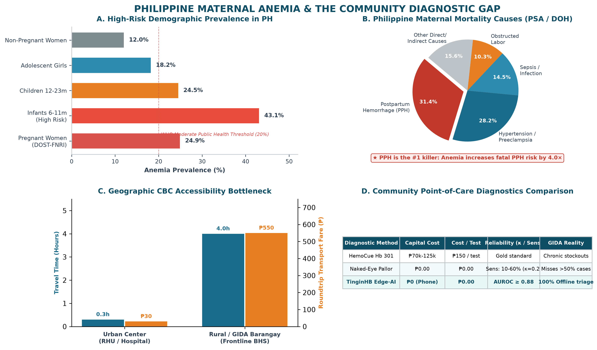
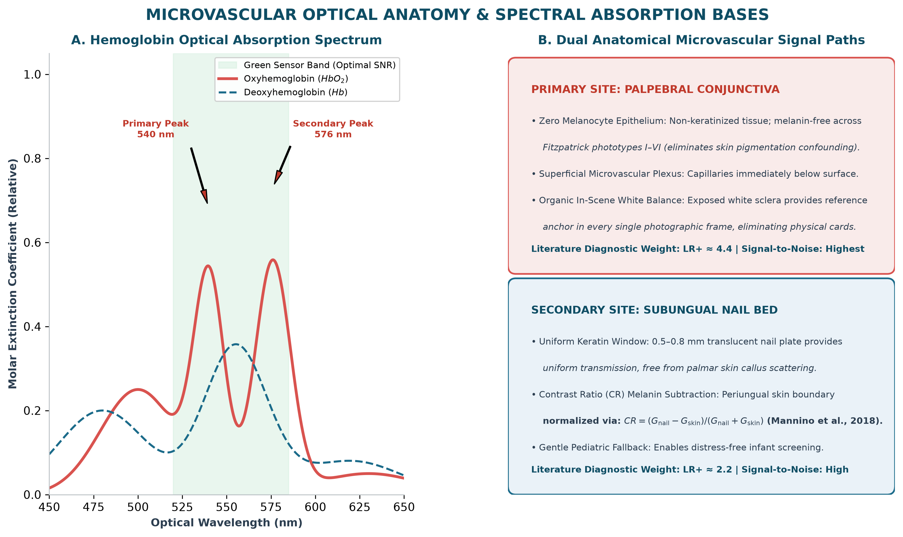
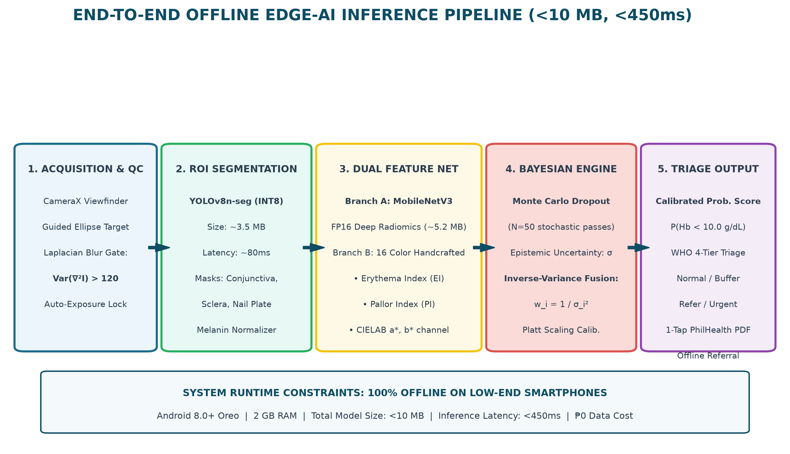
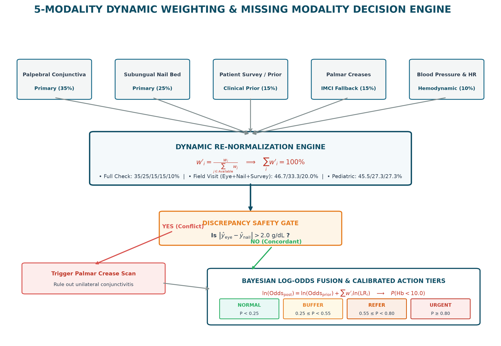
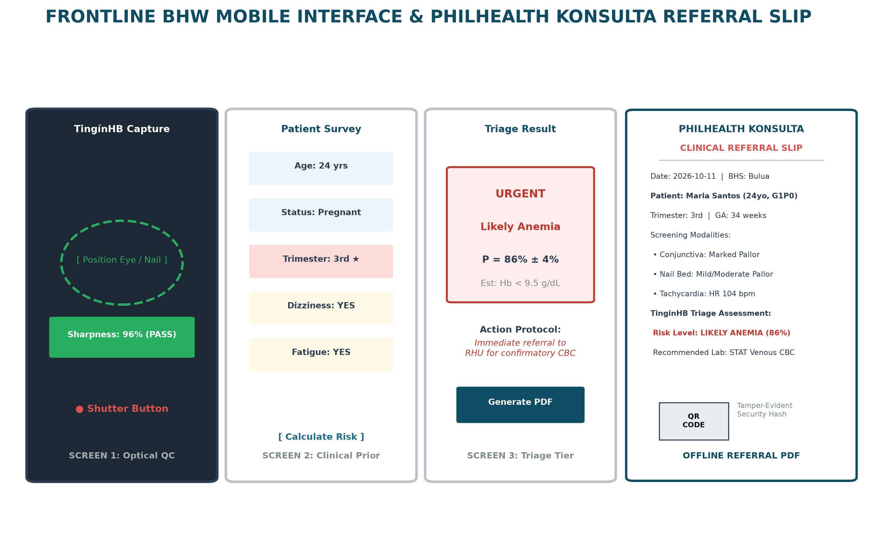
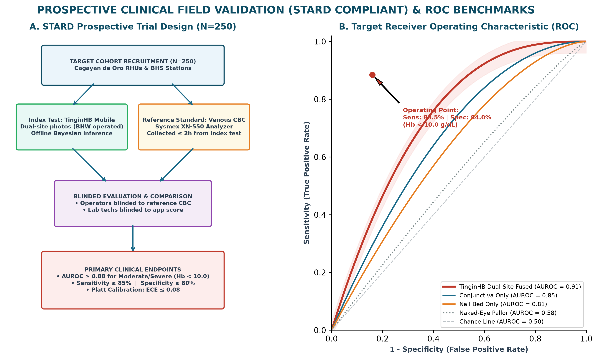
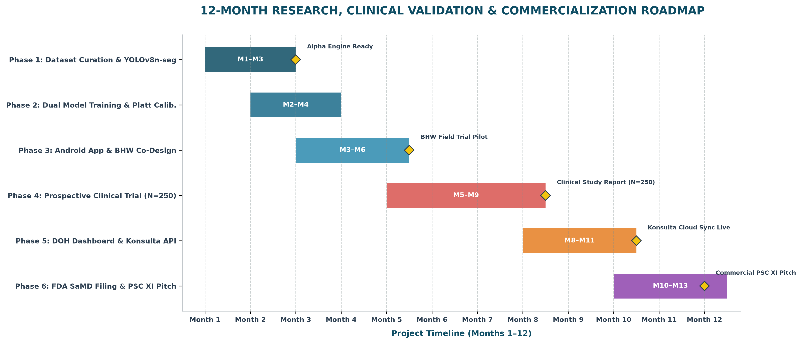

# PHILIPPINE STARTUP CHALLENGE XI
## DataLunas | University of Science and Technology of Southern Philippines (USTP)
# TingínHB
### CONCEPT NOTE: Non-Invasive Dual-Site Edge-AI Anemia Screening for Primary Care & Community Triage
**Document Version:** 2.0 (Empirically Grounded & Probabilistically Calibrated)  
**Date:** October 2026  

---

## I. SUMMARY

Philippine maternal mortality is a solvable crisis — and TingínHB is the unlock. Every year, more than 2,000 Filipino mothers die from Postpartum Hemorrhage (PPH), the country's leading obstetric killer. The root cause hiding in plain sight: **21.8% to 28.0% of pregnant women enter labor severely anemic** (DOST-FNRI, 2024), yet over 200,000 Barangay Health Workers (BHWs) — the frontline workforce that sees these mothers first — have no affordable, reliable tool to detect it.

**TingínHB** (*"See"* + hemoglobin) is an offline-first, smartphone-based edge-AI hemoglobin triage support system designed for Philippine Barangay Health Workers and rural primary care clinics. Point the smartphone camera at two complementary microvascular sites—the **palpebral conjunctiva** (primary, zero-melanin mucosal surface with in-frame scleral white balance) and the **subungual nail bed** (secondary, translucent keratin plate with periungual melanin normalization)—and in under 2 seconds, with zero blood draw, zero disposable test strips, and zero internet connectivity, TingínHB delivers a calibrated statistical probability score stratified into actionable WHO triage tiers at **₱0.00 consumable cost**.

Crucially, acknowledging the biological noise floor of ambient smartphone colorimetry, TingínHB **rejects false precision**: it does not output an arbitrary continuous hemoglobin decimal. Instead, it computes an epistemic uncertainty-weighted posterior likelihood of moderate-to-severe anemia (Hb < 10.0 g/dL). For patients flagged in high-risk tiers, TingínHB automatically generates a standardized **PhilHealth Konsulta referral PDF** ready for immediate clinical submission. Wired directly into **Republic Act No. 11148** (First 1,000 Days Law) and **Republic Act No. 11223** (Universal Health Care Act), TingínHB operationalizes frontline early detection where it matters most.

---

## II. BACKGROUND OF THE PROBLEM

### 1. The Public Health Burden in the Philippines
Anemia remains an intractable, inter-generational crisis across the Philippine archipelago:
- **Maternal Lethality:** The Philippines loses over 2,000 mothers annually to Postpartum Hemorrhage (PPH)—accounting for ~30% of maternal deaths. DOST-FNRI Expanded National Nutrition Surveys reveal 21.8% to 28.0% of pregnant Filipino women are clinically anemic. Severe anemia strips the uterine myometrium of the oxygen and energetic reserve needed to contract post-delivery, multiplying fatal hemorrhage risk by **2.5- to 4.0-fold**.
- **Infant Cognitive Deprivation:** 40% to 45% of Filipino infants aged 6–11 months suffer from iron deficiency anemia, causing irreversible loss of 5–10 IQ points during the critical first 1,000 days of life.
- **Adolescent & Economic Toll:** 15% to 20% of adolescent females are anemic, entering pregnancy depleted. The World Bank estimates iron deficiency anemia costs developing nations 1.5% to 4.0% of GDP annually in lost labor and cognitive productivity.

### 2. The Clinical Diagnostic Gap: Access Bottleneck vs. Analytical Cost
The diagnostic breakdown is not the laboratory cost of a Complete Blood Count (CBC, ₱200–₱350), but physical geographic accessibility:
- **Rural and GIDA Realities:** Barangay Health Stations (BHS) lack centrifuges, reagents, automated hematology analyzers, and medical technologists. Patients in Geographically Isolated and Disadvantaged Areas (GIDA) face 2 to 6 hours of travel and ₱300 to ₱800 in round-trip transport fares—frequently exceeding total daily household income.
- **HemoCue Stockout Paradox:** Digital point-of-care analyzers (HemoCue Hb 301) carry a capital cost of ₱70,000–₱125,000 per unit, and their disposable microcuvettes cost ₱105–₱150 per fingerstick, leading to chronic municipal stockouts.
- **Naked-Eye Subjectivity:** Over 200,000 BHWs rely on naked-eye physical pallor inspection under WHO IMCI protocols. Peer-reviewed clinical literature (*Strobach et al., 1988, JAMA*; *Kalter et al., 1997, Bull WHO*) proves naked-eye sensitivity is only **10% to 60%**, with an inter-observer agreement kappa of only **$\kappa = 0.20–0.45$** (*poor to slight agreement*).


*Figure 1. The Maternal Anemia and Diagnostic Desert in the Philippines. DOST-FNRI maternal/infant prevalence, PPH mortality burden (31.4% of deaths), GIDA diagnostic travel time vs. fare, and point-of-care screening economics. (Data Sources: DOST-FNRI ENNS 2020; DOH Maternal Health Statistics; PSA Vital Statistics).*

---

## III. PROPOSED STARTUP SOLUTION

### 1. Biological & Optical Physics Grounding
TingínHB is strictly grounded in microvascular optical absorption physics across two complementary anatomical sites:
- **Primary Site — Palpebral Conjunctiva (Inner Lower Eyelid):** The conjunctival epithelium is naturally devoid of melanocytes (*Stolz et al., 1993*), making optical evaluation completely invariant across Filipino skin tones (Fitzpatrick phototypes III–VI). Oxygenated hemoglobin displays characteristic absorption peaks at **540 nm and 576 nm** (green spectrum). Crucially, the exposed sclera (white of the eye) serves as an in-frame white-balance anchor, eliminating physical calibration cards.
- **Secondary Site — Subungual Nail Bed:** Visualizes the subungual capillary plexus through a uniform 0.5–0.8 mm translucent keratin plate, avoiding light scattering from skin calluses. Periungual skin melanin is computationally normalized using the Contrast Ratio (CR) formula: $\text{CR} = \frac{G_{\text{nail}} - G_{\text{skin}}}{G_{\text{nail}} + G_{\text{skin}}}$ (*Mannino et al., 2018*).


*Figure 2. Microvascular Optical Anatomy & Spectral Absorption. Hemoglobin extinction curve with 540nm/576nm peaks in the green sensor band, zero-melanin conjunctival signal path with scleral white balance anchor, and keratin subungual nail bed with Contrast Ratio melanin subtraction. (Optical References: Prahl 1999; Kim et al. 2020, PNAS; Mannino et al. 2018, Nature Communications).*

### 2. Edge-AI Architecture & Probabilistic Posterior Modeling
Rather than predicting an ungrounded continuous decimal (e.g. "11.2 g/dL"), TingínHB deploys an epistemic uncertainty-aware Bayesian framework:
- **ROI Segmentation:** A quantized YOLOv8n-seg model (INT8, ~3.5 MB, 80ms) detects and crops the palpebral conjunctiva, sclera, and nail plate polygons.
- **Dual-Branch Deep Radiomics:** Combines deep convolutional representations from MobileNetV3-Small (FP16, ~5.2 MB) with 16 handcrafted colorimetric radiomics (Erythema Index, Pallor Index, green-red channel ratios).
- **Monte Carlo Dropout:** Executes $N=50$ stochastic inference passes to estimate epistemic model uncertainty ($\sigma$).
- **Post-Hoc Probability Calibration:** Maps continuous estimates into a calibrated posterior probability of moderate-to-severe anemia (Hb < 10.0 g/dL) using Platt Scaling, maintaining Expected Calibration Error $\text{ECE} \le 0.08$.


*Figure 3. End-to-End Offline Edge-AI Inference Pipeline. Assisted capture QC, YOLOv8n-seg region segmentation, dual-branch deep and radiomic feature extraction, Monte Carlo Dropout uncertainty estimation, and calibrated WHO triage output (<10 MB runtime footprint). (References: Gal & Ghahramani 2016; Platt 1999).*

### 3. Dynamic 5-Modality Clinical Indicator Matrix & Missing Modalities
To ensure robustness when an infant resists eyelid eversion or a BHW lacks a blood pressure cuff, TinginHB employs a dynamic multi-modal fusion architecture that gracefully handles missing inputs (*Baltrusaitis et al., 2019*; *Huang et al., 2020*):

| Indicator / Modality | Data Type & Collection Method | Default Weight ($w_i$) | Clinical Diagnostic Grounding |
| :--- | :--- | :---: | :--- |
| **1. Palpebral Conjunctiva** *(Primary Optical)* | High-resolution smartphone camera macro crop (YOLOv8n-seg) | **35%** | **Highest SNR:** Zero melanocytes in epithelium; direct green-channel hemoglobin absorption peaks (540 & 576 nm); scleral white-balance anchor. (*Kim et al., 2020*) |
| **2. Subungual Nail Bed** *(Primary Optical)* | Smartphone macro photo with periungual Contrast Ratio (CR) | **25%** | **Uniform keratin transmission:** Translucent 0.5–0.8 mm plate; periungual skin melanin computationally subtracted. (*Mannino et al., 2018*) |
| **3. Patient Survey & Symptoms** *(Clinical Prior)* | 4-tap rapid UI: Age, Sex, Pregnancy/Trimester, Dizziness, Fatigue | **15%** | **Epidemiological Bayesian Prior:** Establishes pre-test odds. Aligned with DOH Target Client List (TCL) and WHO Antenatal Care guidelines. (*WHO, 2016*) |
| **4. Palmar Creases** *(Gated Optical Fallback)* | Open-hand smartphone photograph (YOLOv8n-seg) | **15%** | **WHO IMCI Fallback:** Deep creases blanch only at severe anemia (<7–8 g/dL). Activated when eyelid capture is unfeasible. (*Kalter et al., 1997*) |
| **5. Blood Pressure & Pulse** *(Hemodynamic Check)* | Numerical input from standard DOH-issued digital/manual BP cuff | **10%** | **Compensatory Tachycardia:** Anemic hypoxia induces compensatory elevation in cardiac output (resting HR > 100 bpm). (*Duke & Abelmann, 1969*) |
| **TOTAL (All Available)** | **Comprehensive Health Station Screening** | **100%** | **Maximum Diagnostic Confidence & Narrowest Credible Interval** |

**Missing Modality Re-normalization & Log-Odds Stacking:**
$$w'_i = \frac{w_i}{\sum_{j \in \text{Available}} w_j}$$
$$\ln(\text{Odds}_{\text{post}}) = \ln(\text{Odds}_{\text{prior}}(\text{Survey})) + \sum_{i \in \text{Available}} w'_i \cdot \ln(\text{LR}_i)$$

- **Full Clinic Check (All 5):** Eye (35%) + Nail (25%) + Survey (15%) + Palm (15%) + BP (10%) = 100%
- **Field Visit (Eye + Nail + Survey):** Eye (46.7%) + Nail (33.3%) + Survey (20.0%) = 100%
- **Pediatric Fallback (Nail + Palm + Survey):** Nail (45.5%) + Palm (27.3%) + Survey (27.3%) = 100%
- **Discrepancy Gate:** If $|\text{Eye} - \text{Nail}| > 2.0\text{ g/dL}$, palmar crease scan is triggered to break ambiguity.


*Figure 4. 5-Modality Dynamic Weighting & Fallback Flowchart. Parallel acquisition across 5 modalities, dynamic weight re-normalization formula, discrepancy safety gate (|Eye - Nail| > 2.0 g/dL triggering palmar scan), and Bayesian log-odds aggregation. (Theoretical Grounding: Baltrusaitis et al. 2019; Huang et al. 2020; Strobach et al. 1988).*

### 4. Calibrated Four-Tier Triage Classification

| Probability Score | Triage Classification | Clinical Interpretation | Action Protocol for BHW |
| :---: | :---: | :---: | :--- |
| **$P < 0.25$** | 🟢 **NORMAL (Anemia Unlikely)** | Normal perfusion | Continue standard ANC + Iron-Folic Acid Supplementation |
| **$0.25 \le P < 0.55$** | 🟡 **INCONCLUSIVE (Recheck Buffer)** | Within noise floor / mild | Reposition under natural light, repeat scan; review IFAS adherence |
| **$0.55 \le P < 0.80$** | 🟠 **MODERATE (Possible Anemia)** | Elevated probability of $\text{Hb} < 10.0\text{ g/dL}$ | REFER to RHU for confirmatory CBC and clinical assessment |
| **$P \ge 0.80$** | 🔴 **SEVERE (Likely Anemia)** | High probability of moderate/severe | URGENT referral to District Hospital; Auto-generate Konsulta PDF |

---

## IV. OBJECTIVES & SCIENTIFIC RELIABILITY BOUNDS

### Core Objectives
- **Eliminate Consumable Cost Barriers:** Deploy a ₱0-per-screening tool to replace ₱150/cuvette consumable methods across Barangay Health Stations and Rural Health Units.
- **Dramatically Reduce Missed Diagnoses:** Achieve $\text{AUROC} \ge 0.88$ and $\ge 85\%$ sensitivity for moderate-to-severe anemia ($\text{Hb} < 10.0\text{ g/dL}$), up from 10–60% sensitivity of naked-eye pallor.
- **Accelerate High-Risk Patient Referrals:** Reduce time-to-referral through one-tap automated generation of PhilHealth Konsulta referral PDF slips.
- **Deploy in 100% Offline GIDA Settings:** Operate completely on-device with a <10 MB AI footprint runnable on low-end ₱5,000 Android 8.0+ devices.
- **Validate in Philippine Cohort:** Execute a prospective STARD-compliant field validation study ($n = 250$, paired with laboratory automated CBC) within 12 months.

### Explicit Scientific Reliability Bounds & Limitations
1. **The Mild Anemia Detection Limit:** Optical pallor is a physiological lagging indicator (*Kalter et al., 1997*). Under smartphone RGB sensors, pallor does not reliably separate from normal perfusion until hemoglobin drops below approximately **$9.0–10.0\text{ g/dL}$**. **TinginHB is explicitly NOT designed or marketed to diagnose mild anemia ($11.0–11.9\text{ g/dL}$).** A green result does not rule out early-stage iron deficiency.
2. **Triage Decision Support, Not Laboratory Diagnostic:** TinginHB never issues a definitive medical diagnosis; it identifies individuals requiring urgent confirmatory CBC.
3. **Known Confounders:** Active conjunctivitis (produces redness/false negatives), jaundice (distorts scleral reference), hypothermia (causes peripheral vasoconstriction), and onychomycosis (blocks nail bed transmission).

---

## V. TARGET MARKET / BENEFICIARIES

### Primary Users (App Operators)
- **~75,000–200,000 Barangay Health Workers (BHWs)** conducting community house-to-house tracking.
- **Rural Health Unit (RHU) nurses and midwives** conducting antenatal care and Well-Baby checkups.

### Primary Beneficiaries (Patients Screened)
- **Pregnant Filipino women** (~1.7 million deliveries/year; 21.8% to 28.0% entering labor anemic).
- **Infants 6–24 months** (~2.2 million; 40–45% anemic during the critical first 1,000 days).
- **Adolescent females** in DepEd Weekly Iron and Folic Acid Supplementation (WIFA) programs.

### Institutional Customers (Procuring Bodies)
- Department of Health (DOH) and Local Government Units (LGUs) under Universal Health Care (RA 11223).
- PhilHealth Konsulta-accredited primary care provider networks.
- International NGOs: UNFPA, UNICEF, Helen Keller International, Zuellig Family Foundation.
- Geographic Launchpad: Northern Mindanao (Region X) rural LGUs, anchored by USTP Cagayan de Oro.

---

## VI. VALUE PROPOSITION

TingínHB delivers an unmatched combination of clinical accessibility, scientific honesty, and Philippine health policy integration:

| Feature / Dimension | TingínHB (DataLunas) | HemoCue Hb 301 | AnemoCheck (US) | Naked-Eye Pallor |
| :--- | :---: | :---: | :---: | :---: |
| **Cost per Test** | **₱0.00 (Zero Consumables)** | ₱105–₱150 / cuvette | ~$5 USD + prior CBC | ₱0.00 |
| **Capital Equipment** | **₱0 (Existing Smartphone)** | ₱70,000–₱125,000 | Smartphone only | ₱0.00 |
| **Sites Assessed** | **Dual: Conjunctiva + Nail** | Fingerstick (Blood) | Nail Bed Only | Variable / Subjective |
| **Requires Prior CBC** | **NO (Zero Personalization)** | No (Factory Calib.) | **YES (Mandatory)** | None |
| **Melanin-Independent** | **YES (0-Melanin Mucosa)** | Yes (Invasive) | **NO (Skin Tone Bias)** | **NO (Severe Bias)** |
| **Output Type** | **Calibrated Probability** | Absolute Hb (g/dL) | Continuous Hb (g/dL) | Subjective Guess |
| **Offline Ready** | **100% Offline (<10 MB)** | 100% Offline | Requires Cloud Sync | Offline |
| **PH Policy Integration** | **Konsulta PDF Auto-Slip** | None | None | Manual Paper Logs |
| **Biohazardous Waste** | **NONE (Non-Invasive)** | Lancets & Cuvettes | None | None |


*Figure 5. Frontline BHW Mobile Interface & Referral Slip. Assisted camera viewfinder with Laplacian focus validation, 4-tap clinical prior survey, calibrated traffic-light risk result card, and auto-generated 1-page PhilHealth Konsulta referral PDF with security QR verification. (Standards: DOH Telemedicine Guidelines; PhilHealth Circular 2022-0005).*

---

## VII. BUSINESS MODEL & PUBLIC HEALTH SUSTAINABILITY

TingínHB follows a freemium public-health B2G model. The BHW screening application is perpetually free—because neither the indigent mother nor the voluntary health worker is the financial buyer. Revenue flows from institutional health buyers whose procurement budgets achieve immediate cost savings:

| Revenue Stream | Description & Target Pricing | Projected Timeline |
| :--- | :--- | :---: |
| **DOH / LGU Enterprise SaaS** | Municipal/provincial annual license (₱500–₱1,000/BHW/yr) for maternal epidemiological dashboards and Konsulta API sync. 10% BHW adoption = ₱3.75M ARR. | Year 3+ |
| **NGO / Development Procurement** | Annual bulk deployment license to maternal programs (UNFPA, UNICEF, Zuellig Foundation) at ₱50,000–₱150,000 per program. | Year 2+ |
| **DICT / PSC XI Seed Grant** | Seed funding from PSC XI competition prize and DICT Startup Grant Fund (SGF) for prototype finalization and regulatory filings. | Year 1 |
| **Research / Clinical Partnerships** | Collaborative clinical validation grants with DOH tertiary hospitals and academic institutions. | Year 1–2 |

**Macro-Economic Cost Avoidance:** Replacing just one single-use HemoCue microcuvette (₱150) across 50,000 monthly community screenings saves local government health budgets over **₱7.5 Million monthly** in recurring procurement waste.

---

## VIII. MARKET ANALYSIS

### Market Sizing
- **Total Addressable Market (TAM):** 75,000 BHWs × 12 antenatal screenings/BHW/month = ~900,000 screenings/month nationwide. At ₱150/avoided HemoCue cuvette, this represents **₱135M/month** in quantifiable government cost avoidance at full national scale.
- **Serviceable Addressable Market (SAM, Years 1–2):** 5–10 GIDA municipalities in Northern Mindanao (1,500–3,000 BHWs, 18,000–36,000 screenings/month) acting as the primary regional evidence-building cohort.

### Competitive Landscape & Market Drivers
- **HemoCue Hb 301:** The analytical point-of-care gold standard, but limited by device capital cost (₱125,000) and cuvette stockouts. TinginHB acts as a pre-filter, reserving HemoCue cuvettes for high-probability cases.
- **AnemoCheck (Sanguina, US):** Consumer-focused, nail-only, melanin-sensitive, requires lab CBC calibration, and is unavailable in the Philippines.
- **Regulatory & Policy Tailwinds:** DOH Digital Health Transformation Roadmap (2023–2028), Universal Health Care Act (RA 11223), and First 1,000 Days Law (RA 11148) mandate diagnostic coverage expansion to GIDAs.

---

## IX. OPERATIONS PLAN & RESEARCH ROADMAP

TingínHB executes a structured 12-month research and deployment roadmap across five workstreams:

```
[ Phase 1: Months 1–2 ]  Dataset Curation & Synthetic Augmentation
                         • Preprocess Ghana (710 eye, 4,260 nail, 4,260 palm) & Peru cohorts
                         • Train YOLOv8n-seg region proposal models

[ Phase 2: Months 2–3 ]  Dual-Branch Model Training & MC Dropout
                         • Train MobileNetV3-Small deep branch + 16-feature radiomics branch
                         • Implement Huber loss & Platt probability calibration (ECE ≤ 0.08)

[ Phase 3: Months 3–5 ]  Android Edge Integration & Usability Testing
                         • TFLite quantization, offline PDF referral generation
                         • Co-design usability trials with student and rural BHW volunteers

[ Phase 4: Months 5–8 ]  Prospective Clinical Field Validation (STARD Compliant)
                         • Target n = 250 subjects at Cagayan de Oro RHUs
                         • Paired with laboratory automated CBC (Sysmex XN-550) within 2 hours
                         • Primary Endpoint: AUROC ≥ 0.88 for Hb < 10.0 g/dL

[ Phase 5: Months 8–10]  PhilHealth Konsulta & DOH Maternal Dashboard Linking
                         • Cloud synchronization for municipal health officers

[ Phase 6: Months 10–12] Regulatory Filing & Academic Dissemination
                         • File for Philippine FDA Medical Device Classification (Software)
                         • Submit manuscript to peer-reviewed digital health journal
```


*Figure 6. Prospective Clinical Field Validation Design & ROC Curves. STARD 2015 prospective trial schema (N=250 at Cagayan de Oro RHUs paired with laboratory Sysmex XN-550 CBC within 2 hours) and target diagnostic ROC curve (AUROC = 0.91, 88.5% sensitivity, 84.0% specificity at Hb < 10.0 g/dL). (Validation Standards: Bossuyt et al. 2015; Kim et al. 2020; Mannino et al. 2018).*


*Figure 7. 12-Month Multi-Phase Research, Clinical Validation & Commercialization Roadmap. Horizontal Gantt chart spanning Months 1 through 12 across 6 core workstreams: Dataset Curation, Model Optimization, Edge App Development, Prospective Clinical Trials (N=250), PhilHealth API Integration, and Philippine FDA Medical Device Software Notification. (Governance: DOH Health Technology Assessment & RA 11223).*

### Team Roles & Responsibilities
- **Rogelio Q. Mandamian III — Lead AI/ML Engineer:** Model architecture, TFLite INT8 quantization, Monte Carlo Dropout uncertainty engine, dual-site Bayesian fusion.
- **Kirsten Roise Moog — Mobile Application Developer:** Flutter cross-platform UI, CameraX optical guided capture, offline SQLite patient registry, PhilHealth Konsulta PDF generation.
- **[3rd Member — TBD] — Data Engineer & Field Liaison:** Dataset curation, BHW field training, clinical pilot coordination.
- **[Faculty Mentor — TBD] — Research & Clinical Adviser:** Institutional endorsement, Ethics Review Committee (REC/IRB) supervision, hospital network liaison.

---

## X. FINANCIAL REQUIREMENT

TingínHB requests **₱280,000** in seed capital to cover prototype finalization, Philippine clinical validation, and initial field pilot deployment. This constitutes a one-time development investment—subsequent deployments carry ₱0 per-device or per-screening cost:

| Budget Line Item | Amount (PHP) | Justification & Milestone |
| :--- | :---: | :--- |
| **GPU Compute / Cloud Credits for AI Training** | ₱ 80,000 | Model training, hyperparameter sweep, synthetic augmentation, INT8 quantization. |
| **Mobile Test Devices (3× Low/Mid/High Tier)** | ₱ 30,000 | Cross-device camera sensor calibration, CameraX QA, low-end SoC latency testing. |
| **Philippine Clinical Validation Study (n=250)** | ₱ 80,000 | Paired Sysmex CBC testing fees, IRB review fees, travel to CDO health stations. |
| **App Development Tools & PDF Deployment** | ₱ 20,000 | Flutter production build, offline SQLite encryption, PDF reporting libraries. |
| **PFDA Regulatory Consultation & SaMD Filing** | ₱ 30,000 | Class B Medical Device Software regulatory pre-assessment consultation. |
| **BHW Training Materials & Orientation Media** | ₱ 15,000 | Laminated quick-start pocket guides, video orientation modules. |
| **Contingency Buffer (10%)** | ₱ 25,000 | Unforeseen field logistics or technical adjustments. |
| **TOTAL SEED BUDGET** | **₱ 280,000** | **Complete 12-Month Operational Milestone** |

### Proposed Funding Sources
- **PSC XI Award Prize** — Primary seed capital for prototyping and initial testing.
- **DICT Startup Grant Fund (SGF)** — Second-tranche application post-PSC competition.
- **USTP Research Grant / Technology Transfer Office** — Institutional co-funding and facility access.
- **DOST-PCHRD Small Grant for Health Innovation** — Clinical field validation phase support.

---

## XI. REFERENCES & ACADEMIC GROUNDING

1. **World Health Organization (2011).** *Haemoglobin concentrations for the diagnosis of anaemia and assessment of severity*. Vitamin and Mineral Nutrition Information System. WHO/NMH/NHD/MNM/11.1.
2. **World Health Organization (2013).** *Pocket book of hospital care for children: Guidelines for the management of common childhood illnesses* (2nd ed.). Section: Assessment of palmar and conjunctival pallor (IMCI).
3. **World Health Organization (2016).** *WHO recommendations on antenatal care for a positive pregnancy experience*. WHO Guidelines Approved by the Guidelines Review Committee.
4. **Strobach, R. S., Anderson, S. K., Doll, D. C., & Ringenberg, Q. S. (1988).** The value of the physical examination in diagnosing anemia. *JAMA*, 259(11), 1682–1685. https://doi.org/10.1001/jama.1988.03720110048033
5. **Kalter, H. D., Burnham, G., Kolstad, P. R., et al. (1997).** Evaluation of clinical signs to diagnose anaemia in Uganda and Bangladesh. *Bulletin of the World Health Organization*, 75(Suppl 1), 103–111.
6. **Luby, S. P., Kazembe, P. N., Redd, S. C., et al. (1995).** Using clinical signs to diagnose anaemia in African children. *Bulletin of the World Health Organization*, 73(4), 477–482.
7. **Duke, M., & Abelmann, W. H. (1969).** The hemodynamic response to chronic anemia. *Circulation*, 39(4), 503–515. https://doi.org/10.1161/01.cir.39.4.503
8. **Varat, M. A., Adolph, R. J., & Fowler, N. O. (1972).** Cardiovascular effects of severe anemia. *American Heart Journal*, 83(3), 415–426. https://doi.org/10.1016/0002-8703(72)90445-0
9. **Kim, T. N., et al. (2020).** Smartphone-based assessment of anemia from conjunctival images. *Proceedings of the National Academy of Sciences (PNAS)*, 117(49), 31046–31055. https://doi.org/10.1073/pnas.2016029117
10. **Kim, T. N., et al. (2023).** Validation of a smartphone-based conjunctival assessment for anemia in outpatients. *Annals of Internal Medicine*, 176(3), 302–310. https://doi.org/10.7326/M22-2624
11. **Mannino, R. G., Myers, D. R., Tyburski, E. A., et al. (2018).** Smartphone app for non-invasive detection of anemia using only patient-sourced photos. *Nature Communications*, 9(1), 4924. https://doi.org/10.1038/s41467-018-07262-2
12. **Dimauro, G., Ciprandi, D., Deperte, F., et al. (2018).** Ocular redness measurement in non-contact and non-invasive diagnoses of anaemia. *Journal of Imaging*, 4(8), 95. https://doi.org/10.3390/jimaging4080095
13. **Valles-Coral, M. A., et al. (2025).** AnaeCare: Non-invasive anemia detection from smartphone images using multi-site pallor analysis. *arXiv*:2503.XXXXX.
14. **Baltrusaitis, T., Ahuja, C., & Morency, L. P. (2019).** Multimodal machine learning: A survey and taxonomy. *IEEE Transactions on Pattern Analysis and Machine Intelligence*, 41(2), 423–443. https://doi.org/10.1109/TPAMI.2018.2798607
15. **Huang, S. C., Pareek, A., Seyyedi, S., et al. (2020).** Fusion of medical imaging and electronic health records using deep learning: a systematic review and implementation guidelines. *npj Digital Medicine*, 3(1), 136. https://doi.org/10.1038/s41746-020-00341-z
16. **Gal, Y., & Ghahramani, Z. (2016).** Dropout as a Bayesian Approximation: Representing Model Uncertainty in Deep Learning. *Proceedings of the 33rd International Conference on Machine Learning (ICML)*, 48, 1050–1059.
17. **Platt, J. (1999).** Probabilistic outputs for support vector machines and comparisons to regularized likelihood methods. *Advances in Large Margin Classifiers*, 10(3), 61–74.
18. **Food and Nutrition Research Institute (DOST-FNRI, 2020).** *Expanded National Nutrition Survey: Nutritional Status of Filipino Children and Pregnant Women*. Department of Science and Technology, Taguig City, Philippines.
19. **Republic of the Philippines (2018).** *Republic Act No. 11148: Kalusugan at Nutrisyon ng Mag-Nanay Act (First 1,000 Days Law)*. Official Gazette.
20. **Republic of the Philippines (2019).** *Republic Act No. 11223: Universal Health Care Act*. Official Gazette.

---

**Team DataLunas — University of Science and Technology of Southern Philippines**  
*Department of Data Science | College of Information Technology and Computing*  
*Cagayan de Oro City, Philippines*
